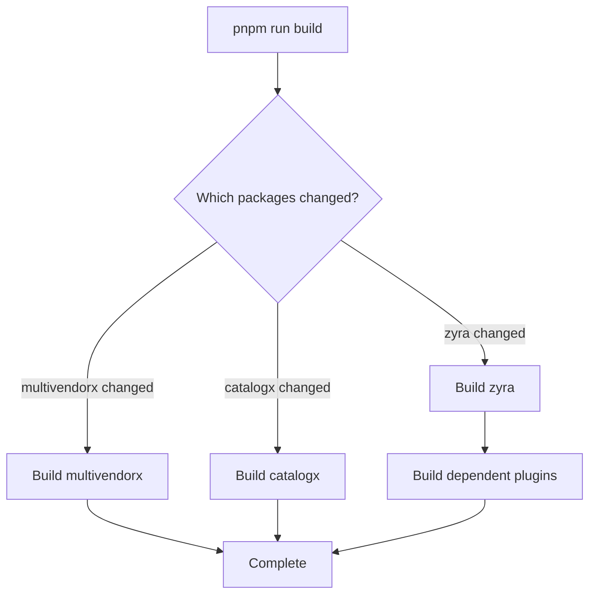

# Monorepo Concept and MultiVendorX Architecture

## What is a Monorepo?

A **monorepo** (mono repository) is a software development strategy where code for multiple projects, packages, or applications is stored in a **single repository** rather than being distributed across multiple separate repositories.

### Traditional Multi-Repo Approach:
```
github.com/company/plugin-a (separate repo)
github.com/company/plugin-b (separate repo)
github.com/company/shared-library (separate repo)
```

### Monorepo Approach:
```
github.com/company/monorepo
  ├── plugin-a/
  ├── plugin-b/
  └── shared-library/
```

---

## Monorepo vs Polyrepo (Multi-Repo)

| Aspect | Monorepo | Polyrepo (Traditional) |
|--------|----------|------------------------|
| **Repository Structure** | Single repo for all projects | Separate repo per project |
| **Code Sharing** | Easy (import from workspace) | Complex (npm publish required) |
| **Dependency Management** | Centralized, consistent versions | Decentralized, version conflicts |
| **Refactoring** | Easy across projects | Difficult, need to coordinate |
| **CI/CD** | Build only changed projects | Each repo has own pipeline |
| **Versioning** | Can version individually or together | Independent versioning |
| **Onboarding** | One clone, see everything | Clone multiple repos |
| **Code Reviews** | See impact across projects | Siloed by project |

---

## Benefits of Monorepo

### 1. **Code Sharing Made Easy**
- Share common components, utilities, and types
- No need to publish packages to npm for internal use
- Changes propagate immediately across projects

### 2. **Atomic Changes**
- Single commit can update multiple projects
- Refactor shared code and all consumers in one PR
- No breaking changes left unaddressed

### 3. **Simplified Dependency Management**
- One `package.json` (or `pnpm-lock.yaml`) to rule them all
- Consistent versions of shared dependencies
- No version conflicts between projects

### 4. **Better Developer Experience**
- Clone once, work on everything
- Single build command for all projects
- Shared tooling configuration (ESLint, TypeScript, Prettier)

### 5. **Improved Code Quality**
- Shared linting and formatting rules
- Consistent coding standards
- Easier to enforce best practices

### 6. **Visibility and Discoverability**
- See all projects in one place
- Find usage examples easily
- Understand system architecture holistically

---

## Challenges of Monorepo

### 1. **Repository Size**
- Can grow very large over time
- Longer clone times for new developers
- **Solution**: Use shallow clones, sparse checkouts

### 2. **Build Times**
- Building everything can be slow
- **Solution**: Incremental builds (Wireit), build only changed projects

### 3. **Access Control**
- Cannot grant per-project access in Git
- **Solution**: Use enterprise tools (GitHub CODEOWNERS) or split sensitive projects

### 4. **CI/CD Complexity**
- Need to detect which projects changed
- Build and test only affected projects
- **Solution**: Smart CI tools (Turborepo, Nx, Wireit)

### 5. **Tooling Requirements**
- Need workspace-aware package managers
- **Solution**: pnpm, Yarn, npm workspaces

---

## What is a Masterrepo?

**"Masterrepo"** is not a standard industry term, but it typically refers to:
- A **main/central repository** in a multi-repo setup
- Or the **root repository** in a monorepo structure

In the context of MultiVendorX, the **masterrepo** refers to:
- The root-level repository that contains all plugins and packages
- The top-level configuration and orchestration point
- Essentially, it's synonymous with "monorepo" in this context

---

## MultiVendorX Monorepo Architecture

### Repository Structure

```
multivendorx/ (ROOT - THE MONOREPO/MASTERREPO)
├── package.json              # Root package.json (workspace orchestrator)
├── pnpm-workspace.yaml       # Defines workspace packages
├── pnpm-lock.yaml            # Locks all dependency versions
├── .eslintrc.js              # Shared ESLint config
├── .editorconfig             # Shared editor config
├── .gitignore                # Shared Git ignore rules
├── .syncpackrc               # Dependency version sync config
│
├── packages/                 # Reusable libraries/packages
│   └── js/
│       └── zyra/             # Shared React component library
│           ├── package.json  # Package-specific config
│           ├── src/          # Source code
│           └── build/        # Built output
│
├── plugins/                  # WordPress plugins (products)
│   ├── multivendorx/         # Main marketplace plugin
│   ├── catalogx/             # Catalog mode plugin
│   ├── moowoodle/            # Moodle integration plugin
│   └── notifima/             # Stock alert plugin
│       ├── package.json      # Plugin-specific config
│       ├── composer.json     # PHP dependencies
│       ├── src/              # Source code
│       └── classes/          # PHP classes
│
└── tools/                    # Development tools
    └── storybook/            # Component documentation
        └── package.json      # Tool-specific config
```

### Workspace Architecture

The monorepo uses **pnpm workspaces** to manage multiple packages:

#### `pnpm-workspace.yaml`:
```yaml
packages:
  - 'packages/js/*'      # JavaScript packages (zyra)
  - 'packages/php/*'     # PHP packages (future)
  - 'plugins/*'          # All WordPress plugins
  - 'tools/storybook'    # Development tools
```

This tells pnpm to treat each folder as a separate **workspace package**.

---

## How Workspaces Work

### 1. **Installation**
When you run `pnpm install` at the root:
- pnpm reads `pnpm-workspace.yaml`
- Installs dependencies for **all** workspace packages
- Creates a shared `node_modules` at the root
- Symlinks packages that depend on each other

### 2. **Dependency Resolution**

#### Root Dependencies (in `/package.json`):
```json
{
  "devDependencies": {
    "@wordpress/scripts": "^30.16.0",
    "webpack": "5.99.x"
  }
}
```
These are **hoisted** to the root `node_modules` and shared by all packages.

#### Package Dependencies (in `/plugins/multivendorx/package.json`):
```json
{
  "dependencies": {
    "zyra": "workspace:*"
  }
}
```
The `workspace:*` protocol tells pnpm to link to the local `zyra` package instead of downloading from npm.

### 3. **Linking**
```
plugins/multivendorx/node_modules/zyra -> ../../../packages/js/zyra
```
Changes to Zyra are immediately available to plugins (no publish needed).

---

## Monorepo Build System

### Wireit Build Orchestration

MultiVendorX uses **Wireit** for incremental builds:

```json
// plugins/multivendorx/package.json
{
  "wireit": {
    "build:project:bundle": {
      "command": "wp-scripts build",
      "files": ["src/**/*.{js,jsx,ts,tsx,scss}"],
      "output": ["release/assets/**"],
      "clean": true
    }
  }
}
```

**Benefits**:
- **Incremental**: Only rebuilds when source files change
- **Cached**: Reuses previous build outputs
- **Parallelized**: Builds multiple packages concurrently
- **Dependency-aware**: Builds in correct order

### Build Flow



### Build Commands

#### Root-level commands:
```bash
# Build all packages
pnpm run build

# Lint all packages
pnpm run lint

# Test all packages
pnpm run test

# Clean everything
pnpm run clean
```

These commands use pnpm's **workspace filter** to run scripts across all packages:

```json
{
  "scripts": {
    "build": "pnpm -r --workspace-concurrency=Infinity --stream \"/^build:project:.*$/\""
  }
}
```

- `-r`: Run recursively in all workspaces
- `--workspace-concurrency=Infinity`: Run in parallel (unlimited)
- `--stream`: Show real-time output
- `/^build:project:.*$/`: Regex pattern to match scripts

---

## Dependency Management

### Version Synchronization

The monorepo uses **syncpack** to ensure consistent versions:

```bash
pnpm run sync-dependencies
```

This ensures that if multiple packages use `react`, they all use the **same version**.

#### `.syncpackrc`:
```json
{
  "versionGroups": [
    {
      "label": "Use workspace protocol for local packages",
      "dependencies": ["zyra"],
      "preferVersion": "workspace:*"
    }
  ]
}
```

### Shared vs Isolated Dependencies

#### Shared (Hoisted):
- Build tools (webpack, babel)
- Linting tools (eslint, prettier)
- Testing frameworks (jest, vitest)

#### Isolated (Package-specific):
- React (each plugin may use different React components)
- WordPress blocks (plugin-specific blocks)

### pnpm Advantages for Monorepo

1. **Fast**: Uses symlinks, no duplicate installations
2. **Disk-efficient**: Single shared store for all packages
3. **Strict**: Prevents phantom dependencies
4. **Workspace-aware**: Native monorepo support

---

## Monorepo Workflows

### Development Workflow

#### 1. **Clone Repository** (one time):
```bash
git clone https://github.com/multivendorx/multivendorx.git
cd multivendorx
```

#### 2. **Install Dependencies** (one time):
```bash
pnpm install
```
This installs dependencies for **all** packages.

#### 3. **Develop a Component** (Zyra):
```bash
cd packages/js/zyra
pnpm run watch:build  # Auto-rebuild on changes
```

#### 4. **Use Component in Plugin**:
```bash
cd plugins/multivendorx
# No additional steps needed - changes are already available!
pnpm run watch:build  # Auto-rebuild plugin
```

#### 5. **Test in Storybook**:
```bash
# From root
pnpm run watch:storybook
# Open http://localhost:6006
```

### Release Workflow

#### 1. **Update Version**:
```bash
cd plugins/multivendorx
# Edit config.php and package.json
node bin/version-replace.mjs
```

#### 2. **Build Release**:
```bash
pnpm run build:release
```

#### 3. **Create Release ZIP**:
```bash
# Output: release/multivendorx-5.0.0.zip
```

#### 4. **Publish** (manual or CI):
- Upload to WordPress.org
- Deploy to website
- Create GitHub release

---

## Monorepo Strategies in MultiVendorX

### 1. **Shared Component Library (Zyra)**
- **Problem**: Plugins need common UI components (tables, forms, modals)
- **Solution**: Create Zyra package, import it via `workspace:*`
- **Benefit**: One update propagates to all plugins instantly

### 2. **Shared Configuration**
- **Problem**: Each plugin needs linting, formatting, build config
- **Solution**: Define shared configs at root level
- **Benefit**: Consistent code quality across all plugins

### 3. **Centralized Development Tools**
- **Problem**: Each plugin needs Storybook, testing, etc.
- **Solution**: One Storybook instance in `/tools`
- **Benefit**: Unified component documentation

### 4. **Atomic Commits**
- **Problem**: Change shared component, need to update all consumers
- **Solution**: Single commit updates Zyra + all plugin imports
- **Benefit**: No breaking changes left dangling

### 5. **Efficient CI/CD**
- **Problem**: Don't want to rebuild everything on every commit
- **Solution**: Detect changed packages, build only those
- **Benefit**: Faster CI runs, lower costs

---

## Monorepo Best Practices (Applied in MultiVendorX)

### 1. **Clear Package Boundaries**
```
packages/    -> Libraries (reusable, no direct business logic)
plugins/     -> Products (WordPress plugins)
tools/       -> Development utilities
```

### 2. **Consistent Naming**
- All packages have `package.json` with unique `name`
- Build scripts follow patterns: `build:project:*`, `watch:build:*`

### 3. **Shared Scripts**
Root `package.json` provides shortcuts:
```bash
pnpm run build      # Build everything
pnpm run clean      # Clean everything
```

### 4. **Workspace Protocol**
Always use `workspace:*` for internal dependencies:
```json
{
  "dependencies": {
    "zyra": "workspace:*"
  }
}
```

### 5. **Independent Versioning**
Each plugin has its own version:
- multivendorx: v5.0.0
- catalogx: v6.0.8
- zyra: v1.0.0

They can be released independently.

### 6. **Enforced Package Manager**
```json
{
  "scripts": {
    "preinstall": "npx only-allow pnpm"
  }
}
```
Prevents accidental use of npm or yarn.

---

## Monorepo Tools and Technologies

### Package Management
- **pnpm**: Fast, disk-efficient, workspace-aware package manager
- **pnpm workspaces**: Multi-package management

### Build Orchestration
- **Wireit**: Incremental build system with caching
- **webpack**: JavaScript bundler
- **Rollup**: Library bundler (for Zyra)

### Version Management
- **syncpack**: Keeps dependency versions in sync
- **changelogger**: Generates changelogs (Composer)

### Development
- **Storybook**: Component development environment
- **@wordpress/env**: Local WordPress development (Docker)

### Code Quality
- **ESLint**: JavaScript linting
- **PHP_CodeSniffer**: PHP linting
- **Prettier**: Code formatting

---

## Comparison with Other Approaches

### MultiVendorX Monorepo vs Separate Repos

#### If plugins were in separate repos:

**Problems**:
1. Zyra would need to be published to npm
2. Version conflicts between plugins
3. Updating Zyra requires:
   - Publish Zyra to npm
   - Update package.json in each plugin
   - Test each plugin separately
   - Deploy each plugin separately
4. Hard to see impact of Zyra changes on plugins
5. More complex CI/CD setup

**With Monorepo**:
1. Zyra changes are immediately available
2. Single commit updates everything
3. One PR shows all impacts
4. Consistent tooling
5. Faster development cycles

---

## Real-World Monorepo Examples

### Large Companies Using Monorepos:
1. **Google**: Entire codebase in one monorepo (billions of lines)
2. **Facebook (Meta)**: React, React Native, Jest, etc. in one repo
3. **Microsoft**: Windows, Office partially monorepo
4. **Uber**: Thousands of microservices in one repo
5. **Shopify**: Rails app + mobile apps + libraries

### Popular Monorepo Tools:
- **Nx**: Enterprise-grade monorepo tool
- **Turborepo**: Fast build system for JavaScript/TypeScript
- **Lerna**: JavaScript monorepo management (older)
- **Bazel**: Google's build system (very advanced)
- **Rush**: Microsoft's monorepo manager

---

## MultiVendorX Monorepo: File Structure Deep Dive

### Root Configuration

#### `package.json` (Root)
```json
{
  "name": "multivendorx",
  "private": true,  // Not published to npm
  "workspaces": [...],
  "scripts": {
    "build": "...",
    "clean": "rimraf -v -g \"**/node_modules\" \"plugins/*/vendor\""
  },
  "devDependencies": {
    // Shared dev tools
  }
}
```

**Purpose**:
- Orchestrates workspace commands
- Defines shared dev dependencies
- Enforces pnpm usage

#### `pnpm-workspace.yaml`
```yaml
packages:
  - 'packages/js/*'
  - 'plugins/*'
  - 'tools/storybook'
```

**Purpose**: Tells pnpm which folders are workspace packages

### Package Configuration

#### `packages/js/zyra/package.json`
```json
{
  "name": "zyra",
  "version": "1.0.0",
  "main": "build/index.js",
  "types": "build/index.d.ts",
  "files": ["build"],  // What gets published
  "dependencies": {
    // Runtime dependencies
  }
}
```

**Purpose**: Defines the Zyra library as a publishable package

#### `plugins/multivendorx/package.json`
```json
{
  "name": "multivendorx",
  "version": "5.0.0",
  "dependencies": {
    "zyra": "workspace:*",  // Link to local Zyra
    "react": "18.3.x"
  },
  "wireit": {
    "build:project:bundle": {...}
  }
}
```

**Purpose**: Defines the MultiVendorX plugin with dependency on Zyra

### Build Scripts

#### Root Level:
```bash
pnpm run build
  ↓
runs "build" script in root package.json
  ↓
pnpm -r (recursive) runs build in all packages
  ↓
zyra builds first (no dependencies)
  ↓
plugins build next (depend on zyra)
```

#### Package Level:
```bash
cd plugins/multivendorx
pnpm run build
  ↓
runs "build" script in multivendorx package.json
  ↓
wireit checks if files changed
  ↓
if yes, runs webpack build
  ↓
outputs to release/
```

---

## Monorepo Mental Model

Think of the monorepo as a **city**:

- **Root**: City hall (governance, shared utilities)
- **Packages**: Libraries (reusable public services)
- **Plugins**: Buildings (individual products)
- **Tools**: Infrastructure (roads, power grid)

All connected, shared infrastructure, but each building is independent.

---

## Advantages for MultiVendorX Specifically

### 1. **Plugin Consistency**
All plugins share:
- UI components (Zyra)
- Build system (Wireit, webpack)
- Code style (ESLint, Prettier)
- Development tools (Storybook)

### 2. **Rapid Feature Development**
Add a new component to Zyra, use it in all plugins immediately.

### 3. **Easier Maintenance**
Fix a bug in Zyra, all plugins benefit instantly.

### 4. **Simplified Onboarding**
New developers:
1. Clone one repo
2. Run `pnpm install`
3. Access all plugins and libraries

### 5. **Atomic Refactoring**
Refactor Zyra API, update all usages in one commit.

---

## Summary

### Monorepo Key Concepts:
- **Single repository** containing multiple projects
- **Workspace management** via pnpm
- **Shared dependencies** for consistency
- **Incremental builds** for efficiency
- **Atomic commits** for coordinated changes

### MultiVendorX Monorepo:
- **Root**: Orchestration and shared config
- **Packages**: Reusable libraries (Zyra)
- **Plugins**: WordPress products (MultiVendorX, CatalogX, etc.)
- **Tools**: Development utilities (Storybook)

### Benefits:
- ✅ Fast development cycles
- ✅ Consistent code quality
- ✅ Easy code sharing
- ✅ Simplified dependency management
- ✅ Better visibility and collaboration

### Trade-offs:
- ⚠️ Larger repository size
- ⚠️ Requires workspace-aware tools
- ⚠️ More complex CI/CD setup
- ⚠️ All-or-nothing access control

The MultiVendorX monorepo architecture enables efficient development of a **cohesive ecosystem** of WordPress plugins with shared components and consistent quality standards.
