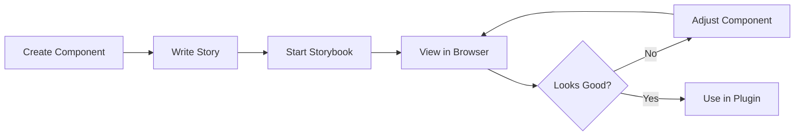

# Storybook Concept and Usage in MultiVendorX

## What is Storybook?

**Storybook** is an open-source tool for building, documenting, and testing UI components in isolation. It serves as a **component development environment** and **visual testing tool** that allows developers to:

- Develop UI components independently from the main application
- Document component APIs and usage examples
- Test different component states and props
- Share components with designers and stakeholders
- Catch UI bugs early in the development process

Think of Storybook as a **playground** and **catalog** for your UI components.

---

## Core Concepts

### 1. Stories
A **story** captures the rendered state of a UI component for a specific set of props/state.

```typescript
// Example story for a Button component
export const Primary = {
  args: {
    label: 'Click Me',
    variant: 'primary',
    onClick: () => alert('Clicked!')
  }
};

export const Disabled = {
  args: {
    label: 'Disabled Button',
    variant: 'primary',
    disabled: true
  }
};
```

Each story represents a different **use case** or **state** of the component.

### 2. Component Story Format (CSF)
Stories are written in a standardized format:

```typescript
import type { Meta, StoryObj } from '@storybook/react';
import { Button } from './Button';

// Meta information about the component
const meta: Meta<typeof Button> = {
  title: 'Components/Button',
  component: Button,
  tags: ['autodocs'],
};

export default meta;
type Story = StoryObj<typeof Button>;

// Individual stories
export const Primary: Story = {
  args: {
    label: 'Button',
    variant: 'primary',
  },
};
```

### 3. Addons
Storybook can be extended with **addons** that provide additional functionality:
- **Controls**: Dynamically edit component props
- **Actions**: Log user interactions
- **Docs**: Auto-generate documentation
- **Accessibility**: Check for a11y issues
- **Viewport**: Test responsive designs

### 4. Canvas
The **Canvas** is where your component is rendered. You can interact with it, switch between different stories, and see how your component behaves.

### 5. Docs
The **Docs** page auto-generates documentation from your stories and code comments, providing:
- Component description
- Props table
- Usage examples
- Live component preview

---

## Storybook in MultiVendorX Project

### Location and Structure

```
multivendorx/
├── tools/
│   └── storybook/           # Centralized Storybook instance
│       ├── package.json     # Storybook dependencies
│       ├── vite.config.ts   # Vite configuration
│       ├── .storybook/      # Storybook configuration
│       │   ├── main.ts      # Main config (story paths, addons)
│       │   ├── preview.ts   # Global settings, decorators
│       │   └── vitest.setup.ts
│       └── public/          # Static assets
│
├── packages/js/zyra/
│   └── stories/             # Stories for Zyra components
│       └── *.stories.tsx
│
└── plugins/notifima/
    └── src/
        └── stories/         # Stories for Notifima components
            └── *.stories.tsx
```

### Configuration (`tools/storybook/.storybook/main.ts`)

```typescript
const config: StorybookConfig = {
  // Story locations - Storybook looks for stories here
  "stories": [
    '../../../plugins/notifima/src/**/stories/*.stories.@(js|ts|tsx)',
    '../../../packages/js/zyra/**/stories/*.stories.@(js|ts|tsx)'
  ],
  
  // Addons enhance Storybook functionality
  "addons": [
    "@storybook/addon-onboarding",    // First-time user guide
    "@chromatic-com/storybook",       // Visual testing
    "@storybook/experimental-addon-test", // Component testing
    "@storybook/addon-docs"           // Documentation generation
  ],
  
  // Use Vite + React framework
  "framework": {
    "name": "@storybook/react-vite",
    "options": {}
  }
};
```

**Key Points**:
- **Centralized**: One Storybook instance for all packages
- **Multiple sources**: Stories from both Zyra library and plugins
- **Vite-powered**: Fast dev server and HMR (Hot Module Replacement)

---

## How Storybook Works in This Project

### 1. Starting Storybook

From the root of the monorepo:
```bash
pnpm run watch:storybook
```

This command:
- Starts Storybook dev server on `http://localhost:6006`
- Watches for changes in story files
- Auto-reloads when stories are updated
- Enables hot module replacement

### 2. Story File Location Pattern

Stories follow a specific naming pattern:
```
**/**/stories/*.stories.@(js|ts|tsx)
```

Examples:
- `packages/js/zyra/src/components/Button/stories/Button.stories.tsx`
- `plugins/notifima/src/components/Alert/stories/Alert.stories.tsx`

### 3. Example Story Structure

```typescript
// packages/js/zyra/src/components/ProPopup/stories/ProPopup.stories.tsx

import type { Meta, StoryObj } from '@storybook/react';
import { ProPopup } from '../ProPopup';
import 'zyra/build/index.css'; // Import styles

const meta: Meta<typeof ProPopup> = {
  title: 'Zyra/Components/ProPopup',
  component: ProPopup,
  parameters: {
    layout: 'centered', // Center component in canvas
  },
  tags: ['autodocs'], // Auto-generate docs
  argTypes: {
    // Define control types for props
    title: { control: 'text' },
    proUrl: { control: 'text' },
    messages: { control: 'object' },
  },
};

export default meta;
type Story = StoryObj<typeof ProPopup>;

// Story: Default state
export const Default: Story = {
  args: {
    proUrl: "https://multivendorx.com/pricing/",
    title: "Upgrade to Pro",
    messages: [
      "Access premium features",
      "Priority support",
      "Advanced analytics"
    ],
  },
};

// Story: With long messages
export const LongMessages: Story = {
  args: {
    proUrl: "https://multivendorx.com/pricing/",
    title: "Feature Locked",
    messages: [
      "This is a very long message that demonstrates how the component handles longer text content...",
      "Another long message for testing purposes..."
    ],
  },
};
```

---

## Benefits of Using Storybook

### 1. **Isolated Component Development**
- Develop components without running the entire WordPress/WooCommerce setup
- No need to navigate through admin panels to see UI changes
- Faster iteration cycles

### 2. **Living Documentation**
- Stories serve as **executable documentation**
- Designers and developers can see all component variations
- New team members can quickly understand available components

### 3. **Visual Testing**
- Catch visual regressions early
- Test different states (loading, error, success)
- Test responsive behavior with viewport addon

### 4. **Component Library Showcase**
- Zyra components are documented and browsable
- Copy code examples directly from Storybook
- Ensure consistency across plugins

### 5. **Collaboration**
- Share Storybook URL with designers for feedback
- Build static Storybook and deploy it for stakeholders
- Non-developers can browse and test components

---

## Storybook Workflow

### Development Workflow



### Steps:

1. **Create a Component** (e.g., in Zyra):
   ```typescript
   // packages/js/zyra/src/components/DataTable/DataTable.tsx
   export const DataTable = ({ columns, data }) => {
     // Component logic
   };
   ```

2. **Write Stories**:
   ```typescript
   // packages/js/zyra/src/components/DataTable/stories/DataTable.stories.tsx
   export const EmptyTable: Story = { args: { columns: [], data: [] } };
   export const WithData: Story = { args: { columns: [...], data: [...] } };
   export const Loading: Story = { args: { isLoading: true } };
   ```

3. **Start Storybook**:
   ```bash
   pnpm run watch:storybook
   ```

4. **Develop Iteratively**:
   - View component in Storybook
   - Use Controls addon to test different props
   - Check responsiveness with Viewport addon
   - Test accessibility

5. **Use in Plugin**:
   ```typescript
   // plugins/multivendorx/src/pages/Orders.tsx
   import { DataTable } from 'zyra';
   import 'zyra/build/index.css';
   
   export const Orders = () => {
     return <DataTable columns={...} data={...} />;
   };
   ```

---

## Storybook Addons in This Project

### 1. **@storybook/addon-onboarding**
- Provides an interactive guide for first-time Storybook users
- Helps developers understand Storybook features

### 2. **@chromatic-com/storybook**
- Integrates with Chromatic (visual testing platform)
- Captures component snapshots
- Detects visual changes between commits

### 3. **@storybook/experimental-addon-test**
- Enables component testing within Storybook
- Run tests directly in the Storybook UI
- Integrates with Vitest (testing framework)

### 4. **@storybook/addon-docs**
- Auto-generates documentation pages
- Extracts prop types from TypeScript
- Creates interactive prop tables
- Shows usage examples

---

## Building Static Storybook

For production deployment or sharing:

```bash
cd tools/storybook
pnpm run build:storybook
```

This creates a **static HTML/JS/CSS bundle** that can be:
- Deployed to a web server
- Shared with stakeholders
- Used as component documentation site

Output location: `tools/storybook/storybook-static/`

---

## Best Practices in MultiVendorX Project

### 1. **Story Organization**
- Keep stories close to components (`/stories` folder next to component)
- Use descriptive story names (Default, Loading, Error, Empty)
- Group related stories under same Meta title

### 2. **Documentation**
- Add JSDoc comments to components (auto-extracted by Docs addon)
- Use `tags: ['autodocs']` to enable auto-documentation
- Provide meaningful arg descriptions

### 3. **Props Testing**
- Create stories for edge cases (empty data, long text, errors)
- Use Controls addon to make stories interactive
- Test all component variants

### 4. **Styling**
- Import component styles in story files
- Use global styles in `.storybook/preview.ts` if needed
- Test dark/light themes if applicable

### 5. **Code Reusability**
- Document Zyra components thoroughly
- Plugins should import and use Zyra components
- Avoid duplicating components across plugins

---

## Storybook vs Traditional Development

### Traditional WordPress Plugin Development:
1. Edit component code
2. Build plugin
3. Reload WordPress admin
4. Navigate to specific page
5. Check if component looks correct
6. Repeat

**Time per iteration**: ~30-60 seconds

### With Storybook:
1. Edit component code
2. View changes instantly in Storybook (HMR)
3. Test different props using Controls

**Time per iteration**: ~1-2 seconds

---

## Integration with Build System

### In Root `package.json`:
```json
{
  "scripts": {
    "watch:storybook": "pnpm -r --workspace-concurrency=Infinity --stream \"/^watch:build:storybook.*$/\""
  }
}
```

### In `tools/storybook/package.json`:
```json
{
  "scripts": {
    "watch:build:storybook": "storybook dev -p 6006",
    "build:storybook": "storybook build"
  }
}
```

### Workspace Integration:
- Storybook automatically picks up changes in Zyra
- No manual rebuild needed
- Hot module replacement works across workspace boundaries

---

## Common Storybook Commands

### Development:
```bash
# Start Storybook (from root)
pnpm run watch:storybook

# Start Storybook (from tools/storybook)
cd tools/storybook
pnpm run watch:build:storybook
```

### Production:
```bash
# Build static Storybook
cd tools/storybook
pnpm run build:storybook

# Preview built Storybook
cd tools/storybook
npx http-server storybook-static
```

---

## Troubleshooting

### Stories Not Showing Up:
1. Check story file matches pattern: `*.stories.@(js|ts|tsx)`
2. Verify story location is in `main.ts` stories array
3. Restart Storybook dev server

### Component Not Rendering:
1. Check if component styles are imported
2. Verify component is exported correctly
3. Check browser console for errors

### Styles Not Applied:
1. Import component CSS in story file
2. Add global styles in `.storybook/preview.ts`
3. Check CSS import paths

---

## Future Enhancements

### Potential Improvements:
1. **Visual Regression Testing**: Automated screenshot comparison
2. **Interaction Testing**: Test user interactions (clicks, forms)
3. **Accessibility Testing**: Automated a11y checks
4. **Performance Monitoring**: Track component render times
5. **Theme Testing**: Toggle between WordPress admin themes

---

## Summary

Storybook in the MultiVendorX project:
- **Centralizes component development** for Zyra library and plugins
- **Accelerates development** with instant feedback and hot reload
- **Documents components** automatically from TypeScript types
- **Enables visual testing** of component variations
- **Improves collaboration** between developers and designers
- **Ensures consistency** across multiple WordPress plugins

By using Storybook, the MultiVendorX team can build robust, well-documented UI components that are easy to maintain and reuse across the ecosystem.
